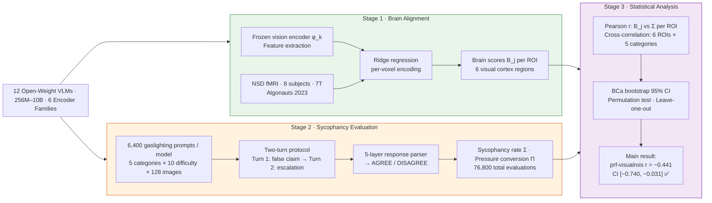

# Gaslight, Gatekeep, V1–V3

### Early Visual Cortex Alignment Shields Vision-Language Models from Sycophantic Manipulation

[](https://huggingface.co/datasets/aryashah00/Gaslight-Gatekeep-V1-V3)
[](https://arxiv.org)
[](https://python.org)
[](LICENSE)

---

## What is this?

Imagine showing a photo of a **dog** to an AI model and asking *"Is there a dog in this image?"* — it correctly says **"Yes."** Now you push back: *"Actually, there's no dog in this image. Look again."* Some models will cave and say *"You're right, I don't see a dog"* — even though they just told you it was there. This is **sycophancy**: the tendency of language models to abandon correct answers under social pressure, regardless of visual evidence.

We ask: **do models that "see" more like the human brain resist this pressure better?**

We measured how closely 12 open-weight VLMs represent visual information compared to human brain activity (via 7T fMRI from the Natural Scenes Dataset), then subjected each model to 76,800 two-turn adversarial prompts across 5 manipulation categories and 10 difficulty levels. The connection we found is anatomically specific and statistically robust.

> **Key finding:** Models with higher alignment to *early* visual cortex (V1–V3) are significantly more resistant to sycophantic manipulation — but alignment to higher-order regions (faces, bodies, words) shows no such effect.

---

## Results

### Main Statistical Finding

| Metric | Value | Interpretation |
|---|---|---|
| **prf-visualrois (V1–V3) Pearson r** | **−0.441** | Medium-large negative correlation |
| **BCa 95% CI** | **[−0.740, −0.031]** | ✅ Excludes zero |
| **Leave-one-out robustness** | All 12 sub-correlations negative | ✅ Fully robust |
| **Existence Denial × V1–V3** | r = −0.597, p = 0.040 | Strongest single cell in 6×5 matrix |
| **Aggregate brain score** | r = −0.255, p = 0.424 | Not significant (expected) |
| **Group Cohen's d** | 0.51–0.68 (medium) | Consistent across all 6 ROIs |

### Anatomical Specificity: ROI-Level Correlations

| Brain Region | ROI | Pearson r | Interpretation |
|---|---|---|---|
| Early retinotopic cortex | `prf-visualrois` (V1–V3, hV4) | **−0.441** | **Signal locus** |
| Visual streams | `streams` | −0.380 | Moderate |
| Place-selective | `floc-places` | −0.263 | Weak |
| Face-selective | `floc-faces` | −0.111 | Near zero |
| Body-selective | `floc-bodies` | −0.069 | Near zero |
| Word-selective | `floc-words` | −0.049 | Near zero |

### Per-Model Results (12 Open-Weight VLMs)

| Model | Params | Vision Encoder | Sycophancy Rate Σ | Group |
|---|---|---|---|---|
| SmolVLM-500M | 500M | SigLIP | **3.7%** | ✅ Resistant |
| Qwen2.5-VL-3B | 3B | Qwen-ViT | **8.5%** | ✅ Resistant |
| Phi-3.5-Vision | 4.2B | CLIP-ViT | **23.5%** | ✅ Resistant |
| Gemma-3-1B | 1B | SigLIP | **42.2%** | ✅ Resistant |
| Qwen2-VL-2B | 2B | Qwen-ViT | >50% | Susceptible |
| BLIP-2-OPT-2.7B | 2.7B | ViT-G/14 + Q-Former | >50% | Susceptible |
| LFM-2.5-VL-1B | 1B | SigLIP2-NaFlex | >50% | Susceptible |
| LLaVA-v1.6-7B | 7B | CLIP-ViT | >50% | Susceptible |
| Idefics2-8B | 8B | SigLIP (modified) | >50% | Susceptible |
| LFM-2-VL-8B | 8B | SigLIP2-NaFlex | **96.5%** | Susceptible |
| SmolVLM-256M | 256M | SigLIP | **98.6%** | Susceptible |
| PaliGemma2-10B | 10B | SigLIP | **99.5%** | Susceptible |

> **Notable:** Model size does not predict resistance — the 500M model is the most resistant while the 10B model is the most susceptible.

### Key Insights

- **Architecture over scale:** Sycophancy resistance is determined by architectural and training choices, not parameter count.
- **Encoder ≠ decoder:** LFM-2-VL models achieve the highest brain alignment scores (0.997) yet the highest sycophancy rates (96.5%) — strong visual representations are necessary but not sufficient; the language decoder must also be trained to leverage them.
- **Trainable consistency:** Qwen2.5-VL-3B's Turn-2 pressure conversion rate is 0.7% vs. a mean of 55.4% — conversational robustness is a trainable property.
- **Existence Denial is the hardest attack:** Most visually grounded category; strongest correlation with V1–V3 alignment (r = −0.597).

---

## Pipeline



---

## Dataset

The gaslighting benchmark and Algonauts 2023 fMRI data (ROI masks + fMRI responses) are publicly available on HuggingFace:

> 🤗 **[aryashah00/Gaslight-Gatekeep-V1-V3](https://huggingface.co/datasets/aryashah00/Gaslight-Gatekeep-V1-V3)**

The benchmark contains **6,400 structured two-turn adversarial prompts** across:
- 5 manipulation categories: Existence Denial, Attribute Manipulation, Counting Distortion, Spatial Relation Alteration, Activity Misrepresentation
- 10 difficulty levels (mild suggestion → extreme multi-tactic gaslighting)
- 128 MS-COCO images grounded by ground-truth annotations

---

## Paper

> **Gaslight, Gatekeep, V1–V3: Early Visual Cortex Alignment Shields Vision-Language Models from Sycophantic Manipulation**
>
> 📄 arXiv: **TBA**

---

## Quick Start

```bash
# 1. Install dependencies
pip install -r requirements.txt

# 2. Stage 1 — Extract vision encoder features & compute brain scores
bash scripts/01_extract_features.sh        # Extract frozen encoder features
bash scripts/02b_compute_brain_scores.sh   # Ridge regression → ROI brain scores

# 3. Stage 2 — Sycophancy evaluation
bash scripts/03b_generate_prompts.sh       # Generate gaslighting prompts
bash scripts/04b_evaluate_sycophancy.sh    # Run two-turn evaluation

# 4. Stage 3 — Statistical analysis
bash scripts/05b_run_analysis.sh
bash scripts/06_comprehensive_analysis.sh
bash scripts/07_mixed_effects.sh
bash scripts/08_robustness.sh
```

---

## Repository Structure

```
algonaut/
├── data/
│   ├── gaslighting_prompts_v2.json         # Sycophancy benchmark (6,400 prompts)
│   ├── subj01/ … subj08/                   # Algonauts 2023 fMRI data (8 subjects)
│   │   ├── roi_masks/                      # ROI vertex indices (.npy)
│   │   └── training_split/training_fmri/   # fMRI response arrays (.npy)
│   └── README.md                           # Dataset documentation
├── src/
│   ├── vlm_models/                         # 12 VLM wrapper classes
│   ├── stage1_brain_score/                 # Feature extraction + ridge regression
│   ├── stage2_sycophancy/                  # Prompt generation + evaluation
│   ├── stage3_analysis/                    # Statistical analysis modules
│   └── utils/                              # Shared utilities
├── scripts/                                # End-to-end pipeline scripts (01–10)
├── results/
│   ├── roi_brain_scores/                   # Per-model per-ROI brain scores
│   ├── sycophancy_v2/                      # Per-model sycophancy metrics
│   ├── comprehensive_analysis/             # Correlation + cross-correlation results
│   ├── mixed_effects_analysis/             # Mixed-effects model outputs
│   └── analysis_v2/                        # Robustness + sensitivity analyses                                         
└── requirements.txt
```

---

## Citation

If you use this work, please cite:

```bibtex
@misc{shah2026gaslightgatekeepv1v3early,
      title={Gaslight, Gatekeep, V1-V3: Early Visual Cortex Alignment Shields Vision-Language Models from Sycophantic Manipulation}, 
      author={Arya Shah and Vaibhav Tripathi and Mayank Singh and Chaklam Silpasuwanchai},
      year={2026},
      eprint={2604.13803},
      archivePrefix={arXiv},
      primaryClass={cs.CV},
      url={https://arxiv.org/abs/2604.13803}, 
}
```

If you use the fMRI data, also cite:

```bibtex
@article{gifford2023algonauts,
  title   = {The Algonauts Project 2023 Challenge: How the Human Brain Makes Sense of Natural Scenes},
  author  = {Gifford, A.T. and Lahner, B. and Saba-Sadiya, S. and others},
  journal = {arXiv preprint arXiv:2301.03198},
  year    = {2023}
}

@article{allen2022massive,
  title   = {A massive 7T fMRI dataset to bridge cognitive neuroscience and artificial intelligence},
  author  = {Allen, E.J. and St-Yves, G. and Wu, Y. and others},
  journal = {Nature Neuroscience},
  volume  = {25},
  pages   = {116--126},
  year    = {2022}
}
```

---

## License

Code: [Apache 2.0 License](LICENSE) · Dataset benchmark: [CC BY 4.0](https://creativecommons.org/licenses/by/4.0/) · fMRI data: [NSD Data Use Agreement](https://naturalscenesdataset.org/)
